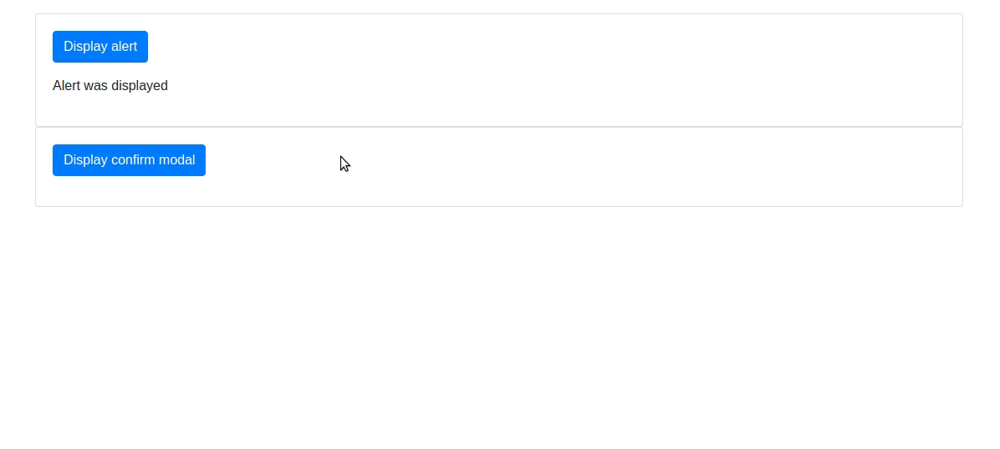

[](https://ui1.io?ref=awesome_rbc)
# Awesome React Bootstrap Components [](https://github.com/sindresorhus/awesome)

> React.js components made using Bootstrap

Most of the following components rely on [react-bootstrap](https://react-bootstrap.github.io/), you can check out their [default components over here](https://react-bootstrap.github.io/components.html).

Also take a look at [classNamed](https://github.com/Hermanya/classnamed-components), it's the easiest way to create your own react component using bootstrap classes and utilities.


---
## [Image Cropper](https://github.com/zhaoyao91/react-bootstrap-image-cropper)


## [Easy Dialog](https://github.com/zhaoyao91/react-bootstrap-easy-dialog)


## [Dialog](https://github.com/akiroom/react-bootstrap-dialog)


## [Confirmation](https://github.com/nicolas-van/react-bootstrap-confirmation)



---
## [Date picker](https://github.com/pushtell/react-bootstrap-date-picker)


---

## [Off-canvas Navbar](https://github.com/Hermanya/react-bootstrap-navbar-offcanvas) 3⃣ 4️⃣


---

## [International telephone input](https://github.com/theslip/react-bootstrap-intl-tel-input) 4️⃣


---

## [Typeahead autocomplete](https://github.com/ericgio/react-bootstrap-typeahead) 4️⃣


---

## [Sweet alert](https://github.com/djorg83/react-bootstrap-sweetalert) 3⃣


---

## [Tabs](https://github.com/freeranger/react-bootstrap-tabs)


---

## [Date range picker](https://github.com/skratchdot/react-bootstrap-daterangepicker) 3⃣


---

## [Select](https://github.com/tjwebb/react-bootstrap-select) 3⃣


---

## [Switch](https://github.com/Julusian/react-bootstrap-switch) ️3⃣


---

## [Slider](https://github.com/brownieboy/react-bootstrap-slider) ️3⃣


---

## [Table](https://github.com/AllenFang/react-bootstrap-table) 3⃣ 4️⃣
 

---

## [Button loader](https://github.com/yury-dymov/react-bootstrap-button-loader)


---

## [React router integration](https://github.com/react-bootstrap/react-router-bootstrap)
```html
<LinkContainer to="/foo/bar">
  <Button>Foo</Button>
</LinkContainer>
```


## Contribute

Contributions welcome!


## License

[](http://creativecommons.org/publicdomain/zero/1.0)

To the extent possible under law, Herman Starikov has waived all copyright and
related or neighboring rights to this work.
